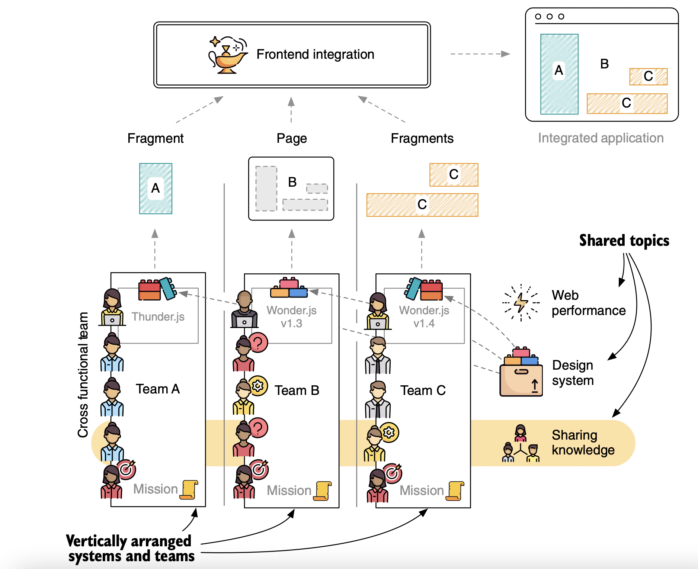
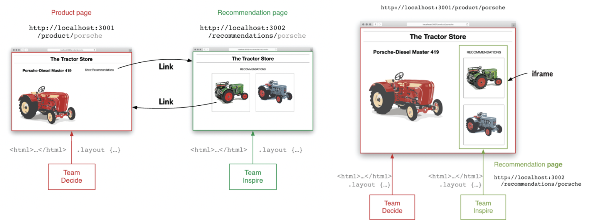
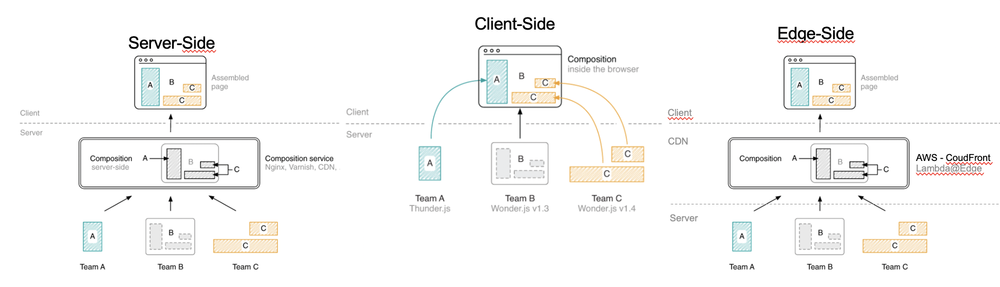
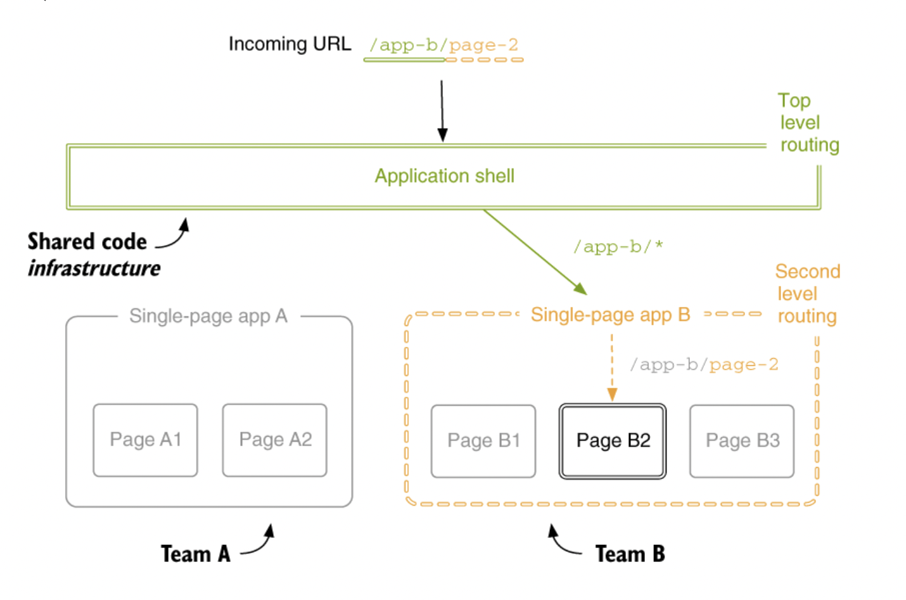
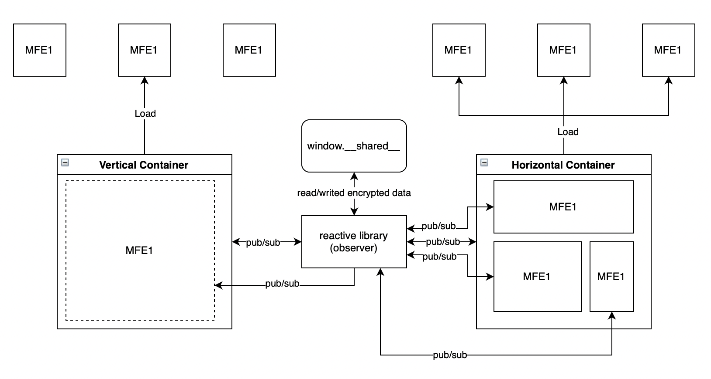

# Lineamientos y buenas prácticas de arquitectura para "MicroFrontend"

El Este documento tiene como propósito enumerar las definiciones que se tienen
que cumplir al implementar o configurar una arquitectura microfrontend

## Objetivo

- Dar a conocer las definiciones establecidas para el tema
  arquitectura microfrontend considerando buenas prácticas.

## Contexto


Un microfrontend representa un dominio empresarial que es autónomo, entregable de forma independiente y propiedad de un equipo. Las principales conclusiones de esta descripción, que se discutirán más adelante, están estrechamente vinculadas a los principios detrás de las microfronteras:

- Representación de dominio empresarial
- Base de código autónoma
- Despliegue independiente
- Propiedad de un solo equipo

Esta arquitectura ofrece muchas oportunidades y opciones de implementacion. Elegir el correcto depende de los requisitos del proyecto, la estructura de la organización y la experiencia del desarrollador.

En este typo de soluciones, nos enfrentamos a algunos desafíos específicos de la arquitectura como son: redundancia, heterogeneidad, consistencia, cada una de estos retos aportan complejidad a la definicion, ademas hay retos asociados a la implementacion, como por ejemplo: cómo queremos comunicarnos entre microfrontends, cómo queremos enrutar al usuario de una vista a otra y, lo más importante, cómo identificamos el tamaño de una microfrontend y/o que vistas pueden ser o no una microfrontend.

Las 4 principales aspectos a tener en cuenta a la hora de definir una arquitectura de microfrontend son:

- **Definition**

  Lo primero es definir si nuestro microfrontend ocupa un espacio de la vista final (horizontal split)o si ocupa toda la pagina(vertical split).
  

  Una definición vertical es una de las soluciones mas estables para implementación de arquitecturas microfronted, en estas cada microfront representa un subdominio en toda la aplicación. Los beneficios que nos brinda esta arquitectura son:

  - **Experiencia de desarrollador similar**

    permite a los desarrolladores trabajar de manera similar a como han trabajado hasta ahora, pero con un contexto más pequeño y menos código del que ser responsables.

  - **Mejor integración con flujos de trabajo actuales**

    Los equipos de desarrollo siguen trabajando en sus flujos de aplicaciones SPA, solo con una variación que viene del lado del empaquetador.

  - **No hay riesgo de conflictos de dependencia**

    En una división vertical siempre cargamos una microfrontend a la vez, debido a su naturaleza. Como resultado, los equipos no tendrán que lidiar con conflictos de dependencias, como diferentes versiones de la misma biblioteca, porque habrá dependencias de una sola microfrontend, reduciendo la posibilidad de errores en tiempo de ejecución y errores en producción. Tampoco habrá ningún choque de estilo CSS porque solo se cargará una hoja de estilo por microfrontend.

  - **Una experiencia de usuario consistente**

    Crear una experiencia de usuario consistente es más fácil con una división vertical porque el mismo equipo está trabajando en una o varias vistas dentro del mismo SPA. Obviamente, se requiere un nivel de coordinación para mantener la coherencia entre microfrontends, pero definitivamente es menos propenso a errores que tener múltiples microfrontend en la misma vista desarrolladas por múltiples equipos (División Horizontal).

  - **Reducción de la carga cognitiva**

    Una división vertical disminuirá la carga cognitiva de sus desarrolladores, porque solo tendrán que dominar y mantener una parte de la plataforma. Esta elección tampoco diluirá las decisiones tomadas por los desarrolladores dentro de su subdominio de negocio. Sin embargo, cada desarrollador debe tener una comprensión general de la arquitectura de la plataforma para entender los puntos de contacto de su dominio comercial y reconocer dónde puede aparecer un error a pesar de no estar dentro de su dominio.

  - **Más rápido en el proceso de embarque**

    El uso de este enfoque conducirá a un proceso de incorporación más rápido porque los equipos pueden utilizar herramientas estándar conocidas y no tendrán que crear las suyas propias para construir, probar e implementar microfrontends. Además, debido a que los equipos serán responsables de solo una parte de la plataforma, se requerirá menos coordinación con otros equipos. Los nuevos desarrolladores integrarse mas rápido, con menos información necesaria para comenzar. Por último, cada equipo puede crear un kit de inicio e inducción para cada nuevo desarrollador acelere el proceso de aprendizaje y hacer que sean capaces de contribuir al código base de la manera más rápida posible.

- **Composition**

  Cada microfrontend es una aplicacion que tiene su propio pipe line, su sistema CI/CD y su web server, la composicion es el proceso que hacemos para servir nuestra aplicacion a usuarios finales donde ellos no deben notar que la aplicacion que estan cargando es la composicion de varias app. Las principales tecnicas para lograr este objetivo que tenemos disponible son:
  

  - **_client-side composition_**
  - **_edge-side composition_**
  - **_server-side composition_**

  El mejor enfoque es componerlos en el lado del cliente teniendo en cuenta que se va a usar un enfoque de división vertical.
  Esto significa que los equipos tendrán que crear un **_shell de aplicación_** que sea responsable de montar y desmontar microfrontends, exponiendo algunas API para permitir la comunicación entre microfrontends y asegurándose de que siempre esté disponible durante la sesión de usuario.

- **Route**

  Debido a que se utilizará una división vertical y tienen una composición en el lado del cliente, el enrutamiento debe ocurrir en el lado del cliente, donde el shell de la aplicación sabe qué microfrontend cargar en función de la ruta seleccionada por el usuario. Este mecanismo también tiene que manejar la funcionalidad de enlace profundo; si un usuario comparte la URL de un articulo con otra persona, el shell de la aplicación debe cargar la aplicación exactamente en ese estado.
  
  Cuando un usuario no autorizado intenta acceder a una parte autenticada del sistema a través de enlaces profundos, el shell de la aplicación debe validar si el usuario tiene un token válido. Si el usuario no tiene un token válido, debe cargar la página de login para que el usuario pueda decidir iniciar sesión o solicitar permisos de acceso según sea el caso.

- **Communication**
  la comunicacion entre microfrontend por definicion de arquitectura es una practica que debe evitarse, sin embargo en una aplicacion 100% desacoplada no es posible en ambientes productivos, el manejo de estado es algo que no podemos desconocer y en ocasiones es muy conveniente conocer datos que provienen desde diferentes componentes. Es muy importante tratar de llegar a un punto de inflexion que no comprometa las bases de la arquitectura pero que si nos deje pasar informacion entre aplicaciones, y para lograr este acometido es importante tener en cuenta que si dos o mas microfrontend necesitan estar constantemente compartiendo estados es mejor no tenerlas separadas.
  Para compartir estados entre aplicaciones tenemos diferentes tecnicas cada una de ellas con un nivel de complejidad diferente:

  - Contenedor a microfrontend.
  - Microfrontend a contenedor.
  - Microfrontend a microfrontend.
  - Dispatch windows Events.
  - Browser event Bus.
  - Broadcast Channel API.(esta no es compatible en safari)
  - Shared library

  Estas tecnicas deben implementarse de acuerdo a la definicion de nuestro microfrontend debido a que en una distribucion de vistas de manera vertical, es decir que solo existe una microfrontend y el contenedor al tiempo el paso de informacion entre ellos debe puede darse a traves de query params o el algun mecanismo de persistencia (window, cookies, local/session storage...).

  Recomendamos el uso de una libreria compartida con una base de codigo agnostica y un sistema de persistencia desacoplado y reactivo que permita su uso sin importar la tecnologia o la definicion de microfrontend implementada.
  
  En la imagen ilustramos como deberian estar los componentes distribuidos. Podemos tener microfrontend en definicion vertical u horizontal, cada uno de estos incluida la aplicacion contenedora deben instanciar la libreria para manejo de estado, esta libreria implementa el patron observer y un sistema de persistencia en el windows tipo pub/sub donde los estados se guardan en una cola de eventos de manera encriptada para proteccion de los datos compartidos.

### Escenarios de usos

- Escenario Shell/Container - (orquestador).
- Escenarios agnosticos usando webcomponets en diferentes framework/librerias para web SPA en definicion vertical y horizontal
  - [Escenario 1 react.](./escenarios/mfe1-react.md)
  - [Escenario 2 vue.](./escenarios/mfe2-vue.md)
  - [Escenario 3 angular.]
- Escenario usando angular module para exportar app completas con rutas internas incluidas.
  - [Escenario 3 angular.](./escenarios/mfe3-angular.md)

## Lista de lineamientos

### Lineamiento 1 - Orquestación y Composicion

- Para orquestar y componer las diferentes microfrontend usaremos `webpack` con el `plugin module federation`. Esta herramienta tecnologia esta disponible a partir de la version 5 de este empaquetador y es compatible con los diferentes framework/librerias para construccion de aplicativos web basadas en javascript/typescript. Con esta tecnologia podemos compartir y/o consumir bundle externos a nuestra app sin tener problemas con las dependencias o versiones del framework usado, ya que internamente webpack se encarga de verificar estos aspectos y darle solucion. Otro importante punto de este plugin es que nos permite tener librerias compartidas entre las diferentes aplicaciones, en otras palabras, si hay una libreria comun entre los aplicativos, esta será descargada e instanciada una sola vez en el app principal o shell en vez de una vez por cada microfrontend que la use.
- Ejemplo: para el funcionamiento del plugin necesitamos pocas configuraciones, en nuestra aplicacion contenedora especificamos en que ruta está nuestra microfrontend, y en el microfrontend le especificamos que archivo queremos exponer. Este puede ser un modulo si vamos a exponer directamente desde angular uno o varios componentes, o la definicion de un web componente desde cualquier framework.

  `webpack.config.js` archivo de configuracion para webpack que debe ir en el shell y el microfrontend.

  ```js
  plugins: [
    new ModuleFederationPlugin({
      // Configuracion solo para el modulo remoto que expone un modulo
      name: 'mfe1',
      filename: 'remoteEntry.js',
      exposes: {
        './Module': './src/app/components/.../view.module.ts',
      },

      // Configuracion solo para el shell.
      remotes: {
        mfe1: 'mfe1@http://localhost:3000/remoteEntry.js',
      },

      // configuracion de Librerias comunes que se comparten entre el shell y el microfrontend
      shared: share({
        '@angular/core': {
          singleton: true,
          strictVersion: true,
          requiredVersion: 'auto',
        },
        '@angular/common': {
          singleton: true,
          strictVersion: true,
          requiredVersion: 'auto',
        },
        '@angular/common/http': {
          singleton: true,
          strictVersion: true,
          requiredVersion: 'auto',
        },
        '@angular/router': {
          singleton: true,
          strictVersion: true,
          requiredVersion: 'auto',
        },
      }),
    }),
  ];
  ```

### Lineamiento 2 - Acondicionar nuestra app para arquitectura microfrontend

- Para trabajar con esta arquitectura podemos partir de una aplicacion nueva o de una existente. Debemos tener claro si vamos a construir una app contenedora o un modulo microfrontend, en cual sea el caso tenemos a disposicion una libreria que nos configura nuestra aplicacion angular para comenzar a construir las diferentes vistas que necesitemos.
- Ejemplo

## Referencias de apoyo

- Titulo. Url.
- Titulo. Url.
